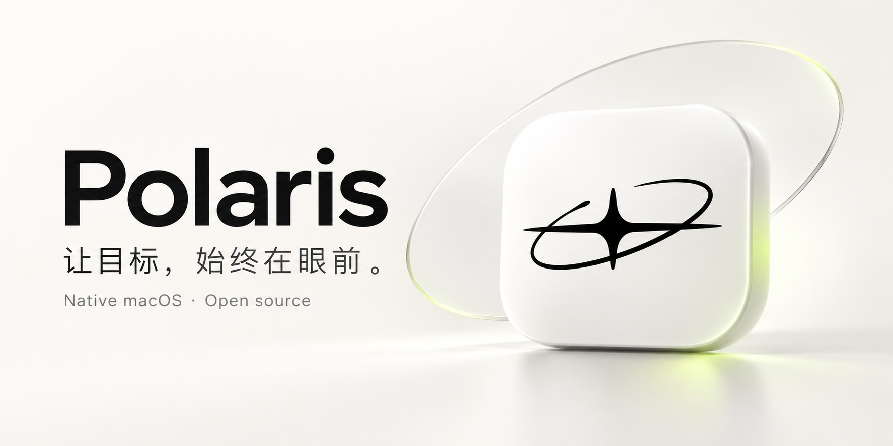
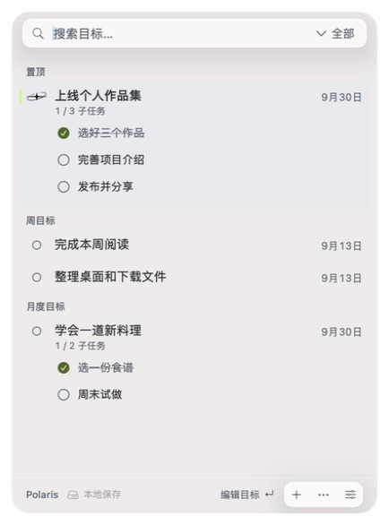
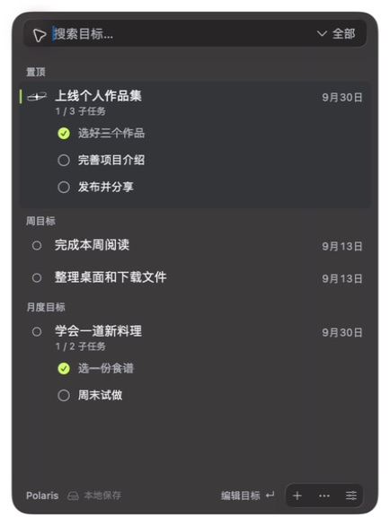
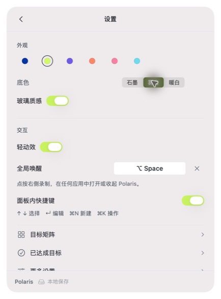
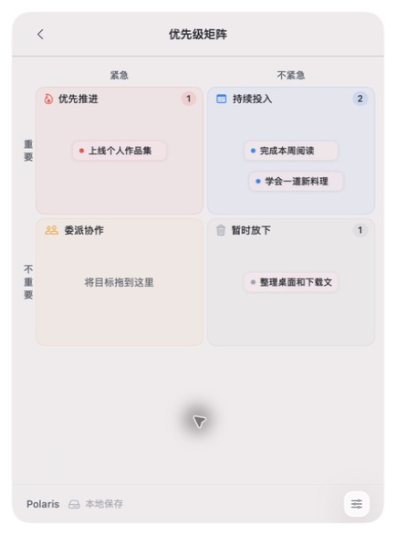

<p align="center">
  
</p>

<p align="center">
  <a href="https://github.com/stardime-bingo/Polaris/actions/workflows/ci.yml"></a>
  <a href="LICENSE"></a>
  
  
</p>

<p align="center"><b>一个安静的 macOS 菜单栏目标工具。</b><br />留住重要的事，展开下一步，然后继续专注。</p>

<p align="center">简体中文 · <a href="README.en.md">English</a> · <a href="docs/BUILDING.md">构建指南</a> · <a href="PRIVACY.md">隐私与同步</a></p>

Polaris 把周、月度、年度与长期目标放在菜单栏。全局快捷键随时呼出，子任务直接显示，完成一步就勾掉一步。使用 SwiftUI 与 AppKit 构建，无 WebView、无应用账户，默认本地保存；需要跨设备时，可连接自己选择的 Apple 提醒事项列表。

## 看看它

<table>
  <tr>
    <td align="center"><br /><b>目标与下一步</b></td>
    <td align="center"><br /><b>安静的深色模式</b></td>
  </tr>
  <tr>
    <td align="center"><br /><b>按自己的习惯调整</b></td>
    <td align="center"><br /><b>看清轻重缓急</b></td>
  </tr>
</table>

顶部是 AI 生成的品牌配图；以上界面均为原生应用实拍，使用脚本生成的**虚构示例数据**，没有真实用户目标。可以用 `./script/build_and_run.sh --demo` 在独立环境中重现。

## 能做什么

- **让主目标常驻菜单栏**：置顶、选择菜单栏主目标、悬停查看长标题；默认 `⌥Space` 呼出，也可录制自己的组合键。
- **把目标拆成下一步**：子任务直接展开，可就地勾选；父目标保持独立完成状态，描述和清单都能编辑。
- **按时间看目标**：周、月度、年度、长期分组与筛选，支持自然日期、全天/指定时间、提醒和重复。
- **保留整理能力**：多个目标集、彩色标签、可自定义的优先级矩阵、已达成历史与 JSON 导入导出。
- **柔和的原生界面**：三种底色、六种点缀色；页面尺寸一致，长内容内部滚动。macOS 26 控制层使用 Liquid Glass，旧系统使用原生材质回退。
- **适量的小动效**：真实同步状态驱动活动图标，短操作不闪动，空闲不持续旋转。玻璃、轻动效和达成庆祝可关闭，适配系统减少透明度/动态效果设置。
- **按需连接提醒事项**：授权并选定列表后双向同步。子任务仍保存在 Polaris 本地与 JSON 备份中，不映射为 Apple 原生子提醒事项。

## 开始使用

**运行环境：macOS 14+。构建环境：Xcode 26+，包含 macOS 26 SDK 与 Icon Composer 资产工具。**

本次开源以源码为主；尚未提供经过 Developer ID 签名及 Apple 公证的安装包。以下命令构建的是供本机使用的 ad-hoc 签名应用。已在 Apple Silicon / macOS 26 验证，Intel 构建与旧系统实机行为仍需贡献者验证。

```bash
git clone https://github.com/stardime-bingo/Polaris.git
cd Polaris
./build.sh
open build/Polaris.app
```

需要长期使用时，将 `build/Polaris.app` 移入“应用程序”。已有 Polaris 时先退出旧实例，避免同时运行两份。系统提醒事项授权仅在启用同步时需要；请使用自己的 Apple 列表。

只想体验界面，可以启动隔离示例：

```bash
./script/build_and_run.sh --demo
```

示例应用有独立身份与虚构数据，禁用提醒事项读写、系统提醒调度和登录项修改，不读取正式目标数据。普通开发预览使用 `./script/build_and_run.sh`，也与正式版隔离。

更多安装、Xcode、调试与签名说明见 [构建指南](docs/BUILDING.md)。

## 快捷键

| 快捷键 | 作用 |
| --- | --- |
| `⌥Space` | 默认全局唤醒；在设置中录制自定义组合键 |
| `↑` / `↓` | 面板中选择目标 |
| `Return` | 编辑所选目标 |
| `⌘N` | 新建目标 |
| `⌘K` | 打开目标操作 |
| `Esc` | 关闭浮层、返回或收起面板 |

面板快捷键可单独关闭。输入中文时不会抢占输入法正在组合的按键。隔离预览不注册系统全局快捷键。

## 数据与隐私

目标、清单与标签默认保存为本机 JSON，通常位于 `~/Library/Application Support/Polaris/`。Xcode 沙盒构建使用其应用容器内的 Application Support。可在“更多设置”中导出备份。

Polaris 没有自己的同步服务器或内置分析服务。Apple 提醒事项同步为可选功能；选中的列表在 Apple 账户中的同步行为由系统管理。删除或完成已同步目标也会影响所选远端列表，子任务本地状态独立保留。完整范围见 [PRIVACY.md](PRIVACY.md)。

## 开发与贡献

```bash
./run-tests.sh
./script/test_step_persistence.sh
```

目前包含 274 项逻辑检查和 11 项 Store 子任务持久化检查。GitHub Actions 同时检查测试、命令行构建和 Xcode Release 构建。UI 改动仍需实际打开应用检查，编译成功不等于交互验收。

欢迎提交问题或改进，先读 [贡献指南](CONTRIBUTING.md)。安全问题请按 [SECURITY.md](SECURITY.md) 私下报告。

## 开源与致谢

Polaris 基于 [@santoru 的 Docket](https://github.com/santoru/docket) 开发，保留原作者署名、MIT 许可证与 Git 历史。上游基线为 `b9735ca`。Polaris 增加了目标周期、子任务、中文体验与原生界面调整。

代码采用 [MIT License](LICENSE)。来源与标志说明见 [NOTICE](NOTICE)；Polaris 版本变更见 [CHANGELOG.md](CHANGELOG.md)。
